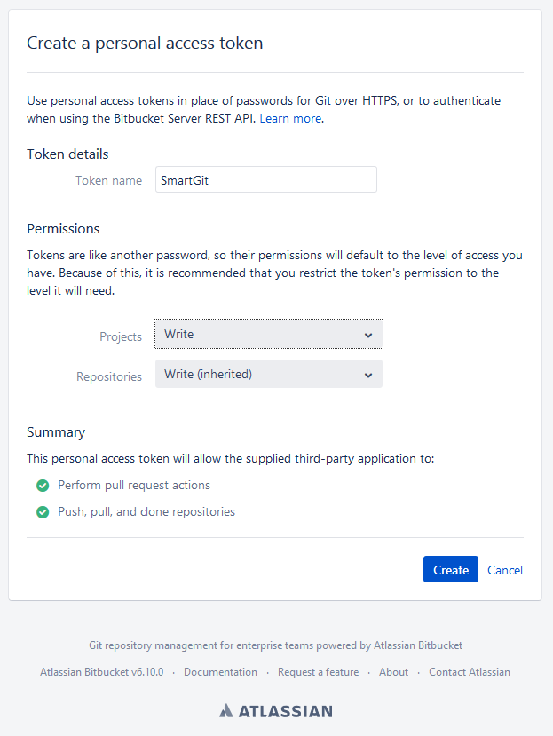

# BitBucket Server (Atlassian Stash) integration

SmartGit integrates BitBucket Server (Atlassian Stash) workflows in
various places, very similar to the
[GitHub](GitHub-integration_1704356.html#GitHubintegration-github)
integration.

### Setup

To set up the BitBucket Serve integration, first you have to create a
*personal access token* in Bitbucket Server: go to **Manage Account**,
select **Personal access tokens** and **Create a token**. For
the **Token name**, use something like "SmartGit" here and for
**Permissions**, select **Write** access.

After invoking **Create**, copy the token to the clipboard and also
consider to store it in some safe place (like a password manager),
because you won't be able to access this token again from the Bitbucket
UI.

In SmartGit, go to **Preferences**, section **Hosting Providers** and
use **Add** there. In the **Add Hosting Provider** dialog, have
**Bitbucket Server** selected:

  - for **Account** use your Bitbucket Server account name
  - for **Password** use the generated access token
  - for **Server URL** enter the same top-level **URL** which you are
    using in your browser to access Bitbucket

  

Note

Unless your server is using 2-way-SSL, you don't need to provide
**Client Certificate** and **Client Password**. Authentication using
*SSH* is unrelated to this configuration.

## Attachments:

[gitlab-authorize.png](attachments/1704357/42598405.png) (image/png)  

[gitlab-applications.png](attachments/1704357/42598406.png)
(image/png)  
 [screenshot-2020-09-03
09\_28\_24-Create a personal access token -
Bitbucket.png](attachments/1704357/42598408.png) (image/png)  

