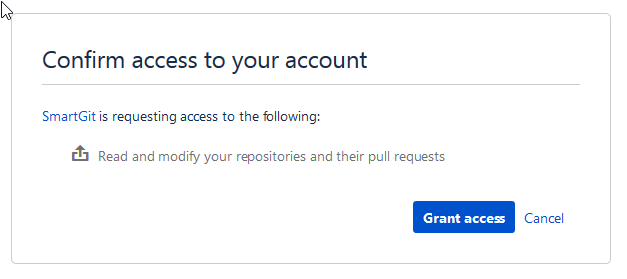
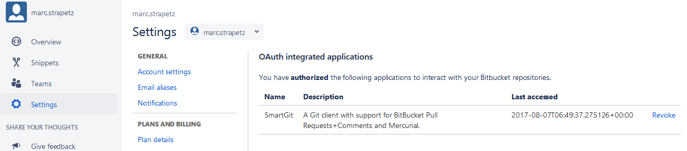

# Bitbucket integration

SmartGit integrates Bitbucket workflows in various places, very similar
to the
[GitHub](GitHub-integration_1704356.html#GitHubintegration-github)
integration. Some behavior can be customized by [system
properties](System-Properties_1704361.html#SystemProperties-properties.bitbucket)
.

### Setup

To set up the Bitbucket integration, go to **Preferences**, section
**Hosting Providers** and use **Add** there. In the **Add Hosting
Provider** dialog, have **Bitbucket** selected and invoke **Generate API
token**. This should open up your default web browser where you will
have to confirm by **Grant**.



Once you have confirmed this page, you will be redirected to
*[syntevo.com](http://syntevo.com)* , where the generated access code
will be displayed. Copy\&paste this code into SmartGit's **Generate API
Token** dialog and invoke **Authenticate**. The code will be used to
create an *application access token* which will be used to populate the
**Token** field. Finally, confirm the **Add Hosting Provider** dialog
using **Add**.

Once you have authorized SmartGit, it will show up in your GitHub
**Settings**, section **OAuth**. If you need to rerun through the
Authorization process outlined above, you have to **Revoke** access
there first and start over.



## Possible Problems & Solutions

### Authenticating with two or more accounts

If you want to authenticate to your Bitbucket repositories, using two or
more accounts, open **Preferences**, section **Hosting Providers**, open
the Bitbucket hosting provider there and deselect **Use OAuth token for
repository authentication**. When pulling/pushing a Bitbucket repository
for the next time, SmartGit will ask you for **Username** and
**Password**. For the **Username**, just enter the appropriate Bitbucket
account name, for the **Password** it's recommended to generate a new
*App password* in your Bitbucket account settings.

Depending on your Git configuration, Git might request credentials only
*per-domain* instead of *per-repository*. If so, try to reconfigure:

<div class="code panel pdl" style="border-width: 1px;">

<div class="codeContent panelContent pdl">

``` java
git config --global credential.useHttpPath true
```

</div>

</div>

Or even more selectively:

<div class="code panel pdl" style="border-width: 1px;">

<div class="codeContent panelContent pdl">

``` java
git config --global credential.bitbucket.com.useHttpPath true
```

</div>

</div>

<div class="pageSectionHeader">

## Attachments:

</div>

<div class="greybox" data-align="left">


[github-authorize-application.png](attachments/1704358/10715157.png)
(image/png)  
 [image2017-4-24
21:29:22.png](attachments/1704358/10715158.png) (image/png)  

[bitbucket-oauth.png](attachments/1704358/10715160.png) (image/png)  

[bitbucket-oauth-applications.png](attachments/1704358/10715161.png)
(image/png)  

</div>
