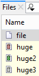

# Git-LFS

SmartGit provides the common Git-LFS operations, provided that Git-LFS
has been installed on your system and it's configured in your Git config
files, so it will work from command line.

# Implementing low-level commands

SmartGit implements low-level Git-LFS commands and provides them in the
**Local|LFS** menu. There is almost a 1-1 correspondence between
SmartGit commands and Git-LFS command line.

<div>

Example: setting up and adding files to Git-LFS

<div>

We are following the [Git-LFS
tutorial](https://github.com/git-lfs/git-lfs/wiki/Tutorial) to add a
file to Git-LFS:

  - `git lfs install`: invoke **Local|LFS|Install**
  - `git lfs track <file>`: select an *untracked* file in SmartGit's
    **Files** view and invoke **Local|LFS|Track**; SmartGit suggests a
    matching pattern for the selected file which you can adjust if
    necessary
  - `git add .gitattributes`: right click `.gitattributes` and invoke
    **Add**
  - `git add <file>`: right click the file and invoke **Add**
  - `git commit`: invoke **Commit**

</div>

</div>

<div>

<div>

If you are encountering unexpected errors when invoking **Lock** or
**Unlock** on Window, this may be caused by a strange behavior of
current Git-LFS versions (2.5) which will fail when invoked with a
working directory with wrong case. To workaround the problem, make sure
that the path in `repositories.xml` has correct case, especially the
drive letter must be uppercase, for example:

<div class="code panel pdl" style="border-width: 1px;">

<div class="codeContent panelContent pdl">

``` java
<obj type="@Repository" id="...">
    <prop key="name" type="String" value="smartgit"/>
    <prop key="favorite" type="boolean" value="true"/>
    <prop key="git" type="boolean" value="true"/>
    <prop key="path" type="String" value="D:\\smartgit"/>
    <prop key="expanded" type="boolean" value="false"/>
</obj>
```

</div>

</div>

</div>

</div>

# Displaying locks

To see Git-LFS lock states in the **Files** views (both Log and Working
tree window), Git-LFS locks verification must be enabled for your
repositories. A corresponding `.git/config` might look like:  
  

<div class="code panel pdl" style="border-width: 1px;">

<div class="codeContent panelContent pdl">

``` java
[lfs "https://server/repo.git/info/lfs"]
    ...
    locksVerify = true
```

</div>

</div>

Furthermore, you have to enable property `pull.queryRemoteLfsLocks` in
the **Preferences**, section **Low-level Properties**. This will make
SmartGit invoke additional commands:

  - `git lfs locks --local`
  - `git lfs locks --remote`

after every fetch for which the output will be written to:

  - `./git/smartgit/lfs-locks-local`
  - `./git/smartgit/lfs-locks-remote`

Once these files are present, the **Name** column icon will start
denoting the locking state for LFS files.

To make SmartGit also display which files are lockable, set low-level
property `status.evaluateLfsLockableState`. This will evaluate the
Git-LFS `lockable` attribute for every file during the refresh.

<div>

Example

<div>

The following screenshot shows how this display will look like:

  - `file` is normal file to which no LFS lock information applies
  - `huge` is *locked by someone else*
  - `huge2` is *locked by yourself*
  - `huge3` is *lockable* (configured in`  .gitattributes `)



</div>

</div>

<div>

<div>

In the **Log** window, lock states will only be displayed for the
**Working Tree** node.

</div>

</div>

  

  

  

  

<div class="pageSectionHeader">

## Attachments:

</div>

<div class="greybox" data-align="left">


[lfs-lock-states.png](attachments/19922963/35160083.png) (image/png)  

</div>
