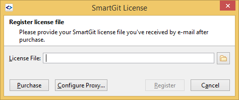

# Register a SmartGit license

After purchasing a SmartGit license, you will receive a `.lic` file. To
register this license file, open SmartGit, invoke **Help|Register** and
select the **License File** there.

Click **Register** and SmartGit will confirm the license details.

`.lic` files are binary files. There are not expected to be opened by
the user.

## Attachments:

 [image2017-1-17
10:45:55.png](attachments/6979694/6979695.png) (image/png)  

